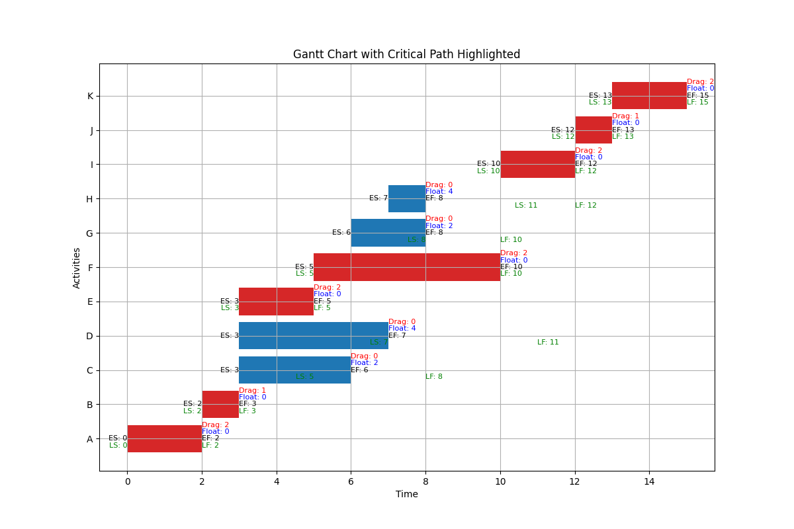
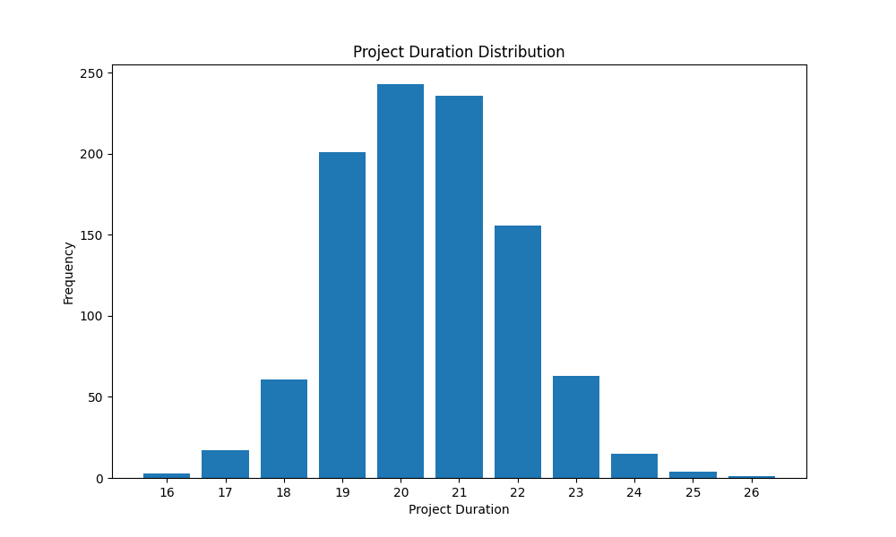
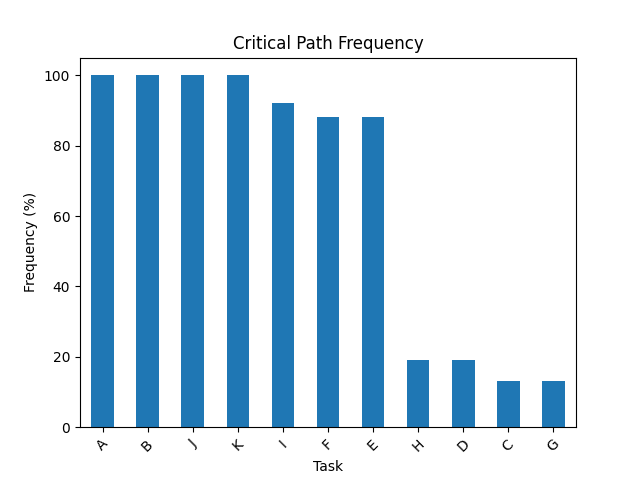

# Project Schedule Optimization with Z3 SMT Solver

This project, developed as part of the Strategic Programs course at the University of Genoa by Sepehr Mohammady, demonstrates the use of the Z3 Satisfiability Modulo Theories (SMT) solver to enhance project management scripts. It focuses on optimizing project durations and validating schedule constraints, building upon concepts from Critical Path Method (CPM) and Probabilistic Risk Assessment (PRA).

## Introduction

The integration of the Z3 SMT solver enhances project management by providing powerful capabilities for optimization and validation. This script showcases how Z3 can be used to:
*   Minimize overall project duration while satisfying all activity dependencies and duration constraints.
*   Ensure that calculated activity timings and dependencies are consistent and logically valid.
*   Provide a more robust and efficient approach to managing project schedules, leading to better project outcomes.

## Key Features of Z3 Integration

*   **Optimization:** Optimizes the project duration by defining it as an objective function to be minimized, subject to various constraints.
*   **Constraint Satisfaction:** Ensures all project constraints are met, including:
    *   Activity durations (e.g., an activity cannot take less than its mean or a predefined minimum duration).
    *   Dependency relationships (e.g., an activity cannot start before its predecessors are finished).
*   **Validation:** The solver inherently validates the consistency of the project schedule based on the defined rules.
*   **Enhanced Analysis:** Offers a formal method to analyze and refine project schedules, ensuring critical paths and activity timings are optimized for efficiency.

## Core Concepts & Z3 Approach

1.  **Decision Variables:** Key aspects of the project schedule, such as the start time, finish time, and duration of each activity, are defined as variables (e.g., `Real` variables in Z3).
2.  **Constraints:**
    *   **Dependency Constraints:** For each activity `i` and its predecessor `j`, `EF_j <= ES_i` (Earliest Finish of `j` must be less than or equal to Earliest Start of `i`).
    *   **Duration Constraints:** `EF_i = ES_i + Duration_i`. Additionally, `Duration_i >= Mean_Duration_i` (or other minimums).
    *   **Project Start:** The first activity/activities can be constrained to start at time 0.
3.  **Objective Function:**
    *   The primary objective is to minimize the total project duration. The project duration is typically defined as the maximum Earliest Finish (EF) time among all terminal activities.
    *   Z3's `Optimize` functionality is used with `opt.minimize(project_duration_variable)`.
4.  **Solving:** Z3 searches for an assignment of values to the decision variables that satisfies all constraints and minimizes the objective function.

*   **(Optional: If applicable) Monte Carlo Simulation Basis:**
    *   The Z3 optimization might be applied to a baseline schedule derived from mean values or from a specific percentile result of a preceding PRA simulation.
    *   This script may first run simulations (similar to PRA) to understand risk impacts, then use Z3 to optimize based on a chosen scenario (e.g., optimizing the schedule for the mean expected durations).

## Technologies Used

*   Python 3.x
*   Z3 SMT Solver (via the `z3-solver` Python library)
*   NumPy (if used for numerical data or in simulation parts)
*   Pandas (if used for data handling or in simulation parts)
*   Matplotlib (for plotting Gantt charts or other visualizations)

## Setup and Installation

1.  Clone the repository:
    ```bash
    git clone https://github.com/SepehrMohammady/Z3SMTSolver.git
    cd Z3SMTSolver
    ```
2.  (Recommended) Create and activate a virtual environment:
    ```bash
    python -m venv z3
    source z3/bin/activate  # On Windows use `z3\Scripts\activate`
    ```
3.  Install dependencies:
    ```bash
    pip install -r requirements.txt
    ```

## How to Run

Execute the Python script from the terminal:
```bash
python Z3SMTSolver.py
```
The script will output the optimized activity durations, the minimized total project duration, and display a Gantt chart of the optimized schedule.

## Example Output

**Console Output (Example):**
```
Optimized Durations:
A: 2.00
B: 1.00
C: 3.00
# ... (fill in with optimized duration for each activity from your script)

Minimized Total Project Duration: XX.X days 
# (Fill in with actual minimized duration from Z3)

Critical Path (based on optimized schedule):
A -> B -> E -> ... 
# (Fill in with actual critical path from the optimized schedule)
```

```
Mean project duration (before optimization): YY.Y days
95th percentile project duration (before optimization): ZZ.Z days

Critical Path Frequency (from simulation):
Task  Freq
A      ...
# ...
```

**Charts:**

**Optimized Gantt Chart:**


**Project Duration Distribution (Pre-Optimization):**


**Critical Path Frequency (Pre-Optimization):**



## License

This project is licensed under the MIT License - see the [LICENSE](LICENSE) file for details.
